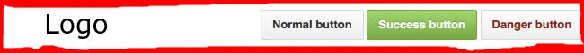

<section>

# APUNTES SASS
Debemos tener instalado Node.js y NPM para saber si esta instalado se escribe en el terminal

- node --version
- npm --version

## INSTALANDO SASS

- sudo gem install sass `href`
- sudo npm install -g sass

## CREAMOS UN PROYECTO CON SASS

- Creo Directorio, mkdir `test_sass`
- Me posiciono dentro de, `test_sass cd test_sass/`
- Creo `touch` para crear archivos touch index.html styles.css styles.scss
- Para probar la compilacion sass --watch styles.scss:styles.css
- Para terminar la compilación `Ctrl-C`

## FRAGMENTOS DE CODIGO
- Crear directorios en el terminal `mkdir`  
- Crea archivos en el terminal `touch`
- Nos desplazamos dentro los directorios `cd ..`

## SASS/
~~~
https://sass-guidelin.es/es/#arquitectura

sass/
|
|– base/
|   |– _reset.scss       # Reset/normalize
|   |– _typography.scss  # Reglas tipográficas
|   …                    # Etc.
|
|– components/
|   |– _buttons.scss     # Botones
|   |– _carousel.scss    # Carousel
|   |– _cover.scss       # Cubierta
|   |– _dropdown.scss    # Dropdown
|   …                    # Etc.
|
|– layout/
|   |– _navigation.scss  # Navegación
|   |– _grid.scss        # Sistema de retícula
|   |– _header.scss      # Encabezamiento
|   |– _footer.scss      # Pie de página
|   |– _sidebar.scss     # Barra lateral
|   |– _forms.scss       # Formularios
|   …                    # Etc.
|
|– pages/
|   |– _home.scss        # Estilos específicos para la página de inicio
|   |– _contact.scss     # Estilos específicos para la página de contacto
|   …                    # Etc.
|
|– themes/
|   |– _theme.scss       # Tema por defecto
|   |– _admin.scss       # Tema del administrador
|   …                    # Etc.
|
|– utils/
|   |– _variables.scss   # Variables Sass
|   |– _functions.scss   # Funciones Sass
|   |– _mixins.scss      # Mixins Sass
|   |– _helpers.scss     # Clases & placeholders
|
|– vendors/
|   |– _bootstrap.scss   # Bootstrap
|   |– _jquery-ui.scss   # jQuery UI
|   …                    # Etc.
|
|
`– main.scss             # Archivo principal de Sass
~~~

## PARA IMPORTAR LOS PARCIALES

- @import 'abstracts/variables';
- @import 'abstracts/mixins';
- @import 'base/base';
- @import 'base/reset';
- @import 'base/typography';
- @import 'layout/header';
- @import 'layout/main-section.scss';
- @import 'layout/forms';
- @import 'components/buttons';
- @import 'components/inputs';
- @import 'pages/home';
- @import 'pages/contact';
- @import 'themes/theme';
- @import 'themes/admin';

## REALIZAR LA COMPILACIÓN
- `sass --watch styles.scss:styles.css`

## BEM / Bloque, Elemento, Modificador.

BEM constituye la metodología que usaremos para nombrar y clasificar selectores CSS de manera estricta, transparente e informativa. Este método se basa en __nombrar las clases en un modo muy específico, ayudándonos a distinguir de manera simple de qué objeto hablamos y si tiene o no aplicado algún tipo de modificador en su estilo, ya sea por interacción del usuario, o por tipología del objeto.__ Cuando utilicemos la metodología BEM, deberemos tener en cuenta que solamente usaremos nombres de clases, nunca IDs, para fomentar así la reutilización de código.

## Como su nombre indica, BEM distingue claramente 3 conceptos: el Bloque, el Elemento y el Modificador.

## El Bloque
Representa la entidad independiente y unica, es decir, el `objeto al que aplicar el estilo.` Un bloque puede componerse de otros bloques. Un buscador simple es un bloque simple, mientras que la cabecera de una web es un bloque compuesto.

Para ejemplificarlo pensaremos en la cabecera de una web: pondremos la clase de nuestro bloque como:
~~~
.main-header
~~~

## El Elemento
Figura como una pieza concreta, de un Bloque cualquiera, que cumple una función. Evidentemente, un bloque puede estar compuesto de varios elementos. Las clases con las que identificamos cada elemento las escribiremos después del nombre del bloque, y las separaremos con dos guiones bajos:
~~~
.bloque__element
~~~
~~~
.main-header__brand
.main-header__primary-nav
.main-header__recursive-nav
.main-header__lang-chooser
~~~

## El Modificador
Son las entidades que usaremos para definir la apariencia o comportamiento de un Bloque o Elemento concreto. Su uso es opcional, pero nos será muy útil para separar claramente el objeto de su estilo gráfico.

Ejemplo de Modificador podemos tener un Menu de navegación que es un bloque que esta situado en el header, en si es un objeto único , pero tambien lo deseamos integrar en el footer, es ahí donde aparencen los modificadores, __recuerden los modificadores son aplicables tanto para los Bloques como para los elementos"__ Ejemplo:

~~~
.main-menu (bloque)
.main-menu-item (elementos __ )
.main-menu--footer (modificador --)
~~~

Los Modificadores los representaremos con doble guión, ejemplo:

~~~
main-header__lang-chooser
main-header__lang-chooser—-isOpen
~~~

## EJEMPLO

Los botones y el logo, están metidos en un bloque. (borde rojo)
Este bloque no depende de ningún otro elemento. Se puede poner en cualquier parte de la página y no cambia en nada.

Ahora analizemos los botones.
Estos 3 botones comparten ciertas características.

-El padding es el mismo.
-El margen es el mismo.
-El tipo de letra es el mismo.
-El tamaño de letra es el mismo.

Cada botón es un elemento. El elemento SI depende del bloque en el que se inserte. Esto significa que por sí solo, el elemento no tiene un significado particular.

Podemos decir que el Element sería como el conjunto de reglas comunes para los botones.
Sin embargo, hay algunas cosas que cambian de forma individual.

El color de la letra.

El color de fondo del botón.
Modifier sería reglas particulares de cada elemento.

## Reglas de escritura CSS en BEM

Para el bloque solo lo escribimos como si fuera una clase normal:
~~~
.bloque{
}
~~~

Como vimos arriba, el elemento tiene que ser parte de un bloque. Entonces usamos doble guión bajo para separar el nombre del bloque del elemento. Para el caso del menú y botones. Sería algo así

~~~
.bloque__boton{
}
~~~

Los modificadores, son parte del elemento (y del bloque), por lo que para separar el modificador del elemento se usa el doble guión corto “ — ”. Para el ejemplo de los botones de arriba, seria algo asi.

~~~
.bloque__boton--rojo{
}
~~~

## Ejemplo de SCSS
~~~

.section-wrapper {
  font-family: $primary-font;
  font-weight: $primary-font-regular;
  margin: 0 auto;
  width: 80%;
}

.nosotros{
  @extend .section-wrapper;
  background-color: $jean-bean;
  color: $white;
  display: table;
  font-size: $font-size-large;
  padding: 150px 0;
  text-align: center;

  &__title {
    display: table-cell;
    font-weight: $primary-font-extra-light;
    vertical-align: middle;

    &--highlighted-text {
      font-weight: $primary-font-bold;
      text-transform: uppercase;
    }
  }
}
~~~

# Bloque Elemento Modificador (Complementando tu aprendizaje)

Bem nace por la necesidad de reutilización de un módulo en cualquier otro proyecto, si utilizamos la forma tradicional de estructurar CSS es poco probable que podamos tomar el bloque del form (Ejemplo a continuación) y dejarlo en cualquier otro proyecto y este mantenga su aspecto. Par esto Bem nos invita a segmentar las distintas secciones de una página HTML e identificarlas como bloques. 

## HTML sin BEM
~~~
<form id="search">

  

  <input type="text" class="input">
  <button class="buttom disable">Search</button>

  

</form>
~~~

## CSS sin BEM
~~~
#search {}
#search .content {}
#search .content .input {}
#search .content .button {}
#search .content .button.disable {}
~~~

## Bloque Elemento Modificador
Preguntas que debes hacerte para asignar los nombres a las clases
~~~
BLOQUE      :¿Qué es ? Un formulario de búsqueda, importante el bloque es una entidad independiente.
ELEMENTO    :¿Cuál es su función? Contener los elementos de interacción, Elemento son hijos del bloque.
MODIFICADOR :¿Cuál es su apariencia, estado o comportamiento?
~~~

## CSS con BEM
~~~
BLOQUE      :nombrebloque
ELEMENTO    :nombrebloque__nombreElemento
MODIFICADOR :nombrebloque__nombreElemento--nombreModificador
~~~
~~~
<form class="searchform">

  

  <input type="text" class="searchform__input">
  <button class="searchform__button searchform__buttondisable">Search</button>

  

</form>
~~~

</section>